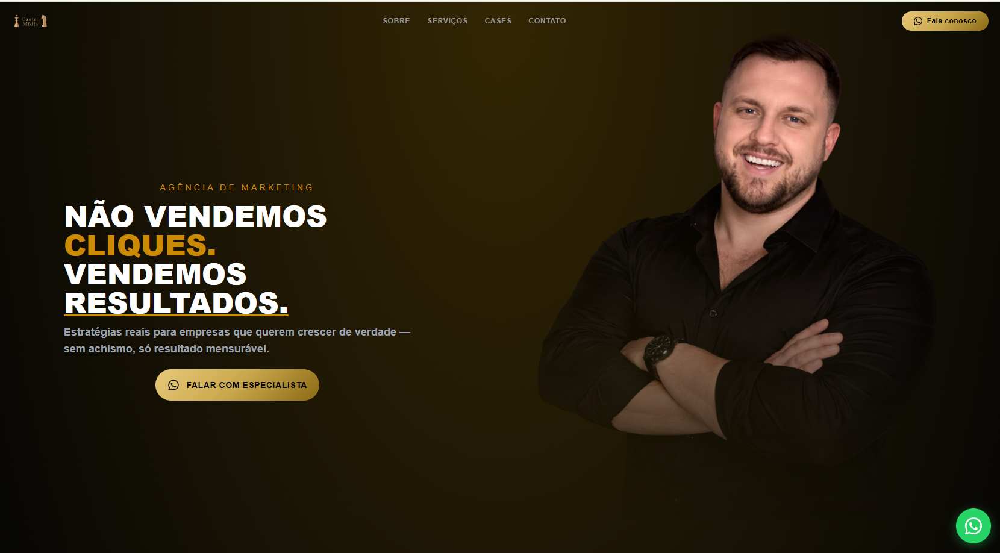
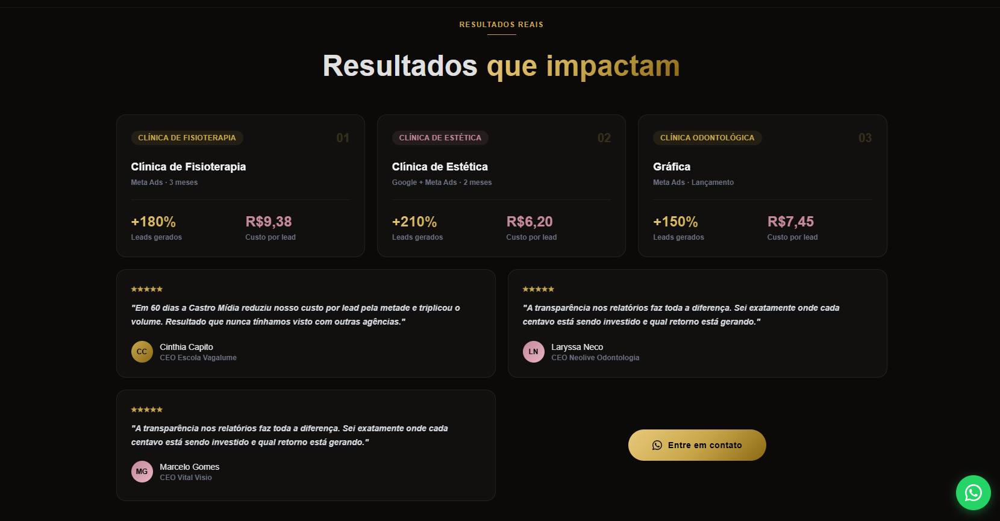
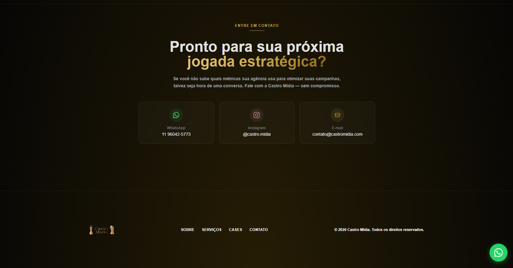

## Castro Mídia - Landing Page 

Uma landing page moderna e responsiva desenvolvida para apresentar os serviços de social media da Castro Mídia, com foco em conversão, identidade visual e experiência do usuário.

A proposta do projeto foi criar uma presença digital profissional, utilizando estratégias de Call To Action (CTA), design alinhado ao manual da marca e uma navegação intuitiva para fortalecer a autoridade da marca no digital. 

</img>

---

### Tecnologias utilizadas
React
Tailwind CSS
JavaScript
Vite

---

### Objetivo do projeto

O projeto foi desenvolvido pensando em:

Fortalecer a identidade visual da marca
Criar uma comunicação moderna e estratégica
Melhorar a captação de clientes
Destacar os serviços de social media
Aplicar técnicas de marketing visual e conversão

</img>

---

### Responsividade

A landing page foi construída com foco em responsividade, garantindo uma boa experiência em:

Desktop
Tablets
Smartphones

### Funcionalidades
Sessões organizadas e estratégicas
Botões de Call To Action
Layout moderno e minimalista
Design baseado no manual da marca
Navegação fluida
Estrutura otimizada para apresentação profissional

---

### Deploy
O projeto está hospedado na Netlify:

[Castro Mídia](https://castromidia.netlify.app/)

---

### Aprendizados

Durante o desenvolvimento deste projeto foram trabalhados conceitos como:

Componentização no React
Estilização com Tailwind CSS
Estruturação de landing pages
Responsividade
Hierarquia visual
UX/UI Design
Estratégias de conversão com CTA

---

</img>

👩‍💻 Desenvolvido por

Letícia Castro 💜
